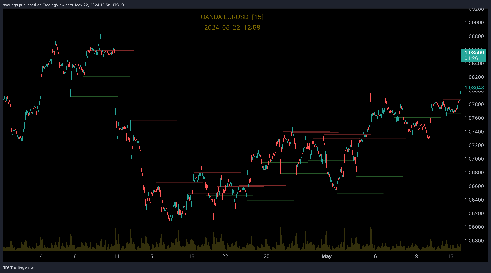

# Algo Trading — cTrader FIX API Example


A small, self-contained example of trading on **cTrader over the FIX 4.4 API**,
driven by a **multi-timeframe RSI** strategy. It connects directly to a broker's
cTrader FIX endpoints — no TradingView webhook, no web server, no third-party
relay — evaluates a signal, and (optionally) places the order itself.

> **Heads up — this is an educational example.** Start with a *demo* account.
> Read the [disclaimer](#disclaimer) before pointing it at real money.

## Features

- 🔌 **Pure-stdlib FIX 4.4 client** for cTrader (QUOTE + TRADE sessions).
- 🔒 **TLS by default** (ports 5211/5212), with a one-line fallback to plain text.
- 📈 **Multi-timeframe RSI strategy** as a small, pure, unit-tested function.
- 🧩 **Decoupled pipeline** — `main.py` orchestrates *fetch → decide → execute*,
  one module per responsibility; bring your own candle feed.
- 🔑 **`.env`-based credentials** laid out to mirror the cTrader FIX API panel.

## The example strategy

The decision engine reproduces the "Multi Timeframe RSI" indicator the project
grew from. Two timeframes, one role each:

- **Trend timeframe** (default 4h) classifies the trend via `RSI > 50`.
- **Entry timeframe** (default 5m) spots the turn via an RSI crossover.

```
BUY  when RSI(trend) > 50   and RSI(entry) crosses up   the oversold line (40)
SELL when RSI(trend) < 50   and RSI(entry) crosses down the overbought line (60)
```

The first condition filters for trend direction; the second times the entry on an
oversold/overbought reversal. RSI uses Wilder's smoothing, matching TradingView's
`ta.rsi`, so signals line up with the chart below. Each horizontal line is one
limit order plotted on `OANDA:EURUSD`:



## Project layout

```
src/
  main.py            Orchestrator: fetch OHLCV -> decide -> execute
  config.py          Load FIX credentials from .env (fails fast if missing)
  market_data.py     Fetch OHLCV closes per symbol/timeframe (the data seam)
  strategy.py        Multi-timeframe RSI decision engine (BUY / SELL / HOLD)
  ctrader_client.py  High-level client: buy/sell/limit/positions/orders
  fix_protocol.py    Raw FIX 4.4 session (logon, market data, order entry)
  stream_buffer.py   Byte buffer that reassembles FIX messages off the socket
  symbols.py         Default symbol id / pip-position reference table
  calculations.py    Spread, pip value and commission helpers
tests/
  test_strategy.py   Behaviour checks for the decision engine
  test_pipeline.py   Wiring check: sample data -> strategy -> signal
```

## Prerequisites

- **Python 3.10+** and [uv](https://docs.astral.sh/uv/).
- A **cTrader account** (start with a demo) at a broker that offers the FIX API.
- **FIX API enabled** for that account — in cTrader: *Settings → FIX API*. That
  page shows the Host, Password and SenderCompID you'll paste into `.env`.

## Setup

```bash
uv sync                       # create the venv and install dependencies
cp .env.example .env          # then fill in your cTrader FIX credentials
```

`.env` holds your credentials and is git-ignored — never commit it.

## Configuration

All configuration lives in `.env`. The template (`.env.example`) is laid out to
match the two connection blocks shown in cTrader's *Settings → FIX API* panel —
both blocks share the same Host, Password and SenderCompID, so you copy those
three values across.

| Variable                 | Required | Default | Description                                                        |
| ------------------------ | :------: | :-----: | ------------------------------------------------------------------ |
| `CTRADER_HOST`           |    ✅    |    —    | FIX host name, e.g. `demo-xx.p.c-trader.com`                |
| `CTRADER_SENDER_COMP_ID` |    ✅    |    —    | Account / SenderCompID, e.g. `demo.broker.1234567`              |
| `CTRADER_PASSWORD`       |    ✅    |    —    | Your FIX API / account password                                    |
| `CTRADER_USE_SSL`        |    —     | `true`  | `true` → TLS ports 5211/5212, `false` → plain text 5201/5202       |
| `CTRADER_CURRENCY`       |    —     | `USD`   | Account deposit currency                                           |

FIX ports, selected automatically from `CTRADER_USE_SSL`:

| Session         | TLS (default) | Plain text |
| --------------- | :-----------: | :--------: |
| QUOTE (prices)  |     5211      |    5201    |
| TRADE (orders)  |     5212      |    5202    |

## Usage

```bash
uv run python src/main.py   # fetch data, evaluate the strategy, act on the signal
```

`main.py` runs the full pipeline — **fetch** OHLCV closes (`market_data.py`),
**decide** with the multi-timeframe RSI strategy (`strategy.py`), and on a `BUY`
or `SELL` signal **execute** the order over FIX (`ctrader_client.py`). Out of the
box it uses `SampleMarketData` (synthetic closes) so it runs offline; swap in a
real provider in `src/market_data.py` and point it at a **demo** account.

Using the pieces directly:

```python
from strategy import MultiTimeframeRsiStrategy, Signal
from ctrader_client import Ctrader
from config import load_config

strategy = MultiTimeframeRsiStrategy()
signal = strategy.decide(entry_closes, trend_closes)   # closes oldest -> newest

if signal is not Signal.HOLD:
    config = load_config()
    client = Ctrader(
        config.host, config.sender_comp_id, config.password, use_ssl=config.use_ssl
    )
    (client.buy if signal is Signal.BUY else client.sell)("EURUSD", 0.01, 0, 0)
```

## Tests

```bash
uv run pytest                                    # full suite
PYTHONPATH=src uv run python tests/test_strategy.py   # zero-dependency self-check
```

## Disclaimer

This project is provided **for educational purposes only** and comes with **no
warranty**. Automated trading carries substantial risk of loss; you are solely
responsible for any orders it sends. Always test against a **demo account**
first, and never trade money you can't afford to lose. Nothing here is financial
advice.

## Credits

Forked from [ejtraderLabs/ejtraderCT](https://github.com/ejtraderLabs/ejtraderCT);
the FIX protocol layer is derived from that project. See the
[cTrader FIX API documentation](https://help.ctrader.com/fix/) for protocol
details.
